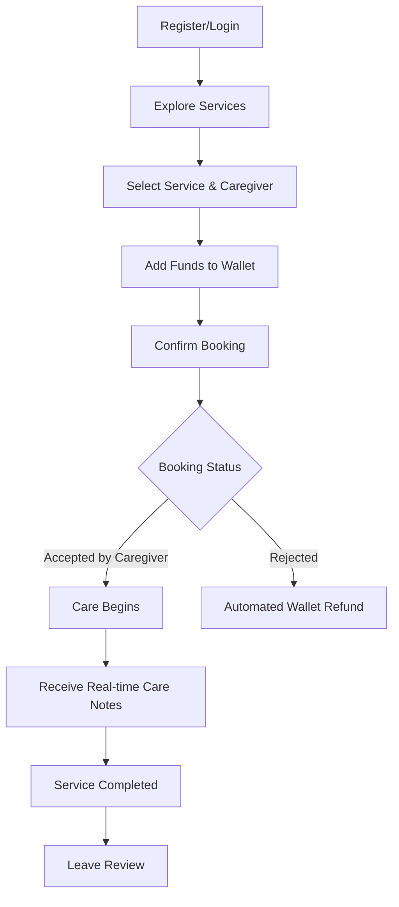
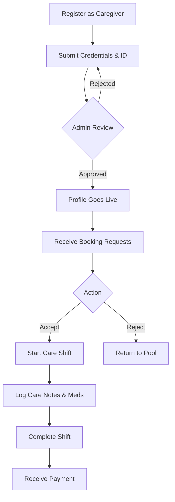

# 🏥 ElderNest

**ElderNest** is a premium, full-stack home healthcare and eldercare management platform. It bridges the gap between families in need of professional eldercare and verified healthcare professionals, providing peace of mind through a robust ecosystem of secure bookings, real-time care updates, automated wallet management, and comprehensive administrative oversight.


---

## 📑 Table of Contents
1. [Platform Overview](#-platform-overview)
2. [Key Features](#-key-features)
3. [User Flows](#-user-flows)
4. [Project & System Flow](#-project--system-flow)
5. [Technology Stack](#-technology-stack)
6. [Getting Started](#-getting-started)
7. [Architecture & Structure](#-architecture--structure)

---

## 🌟 Platform Overview

ElderNest operates on a **Tri-role Architecture**, providing tailored, secure environments for three distinct user types:
1. **User (Family/Patient):** Seek, book, and manage care for their loved ones.
2. **Caregiver (Professional):** Register, verify credentials, accept jobs, and provide care updates.
3. **Admin (Operations):** Oversee platform health, verify caregivers, manage finances/refunds, and curate content.

---

## ✨ Key Features

### 👨‍👩‍👧‍👦 User (Family) Portal
* **Intelligent Booking:** Browse specialized care services and book verified caregivers.
* **Wallet System:** Securely manage funds, pay for bookings, and receive automated refunds.
* **Real-Time Care Updates:** Receive instant notifications, daily medication tracking, and caregiver notes.
* **Review System:** Rate and review caregivers and services to maintain platform quality.

### 👩‍⚕️ Caregiver Portal
* **Rigorous Verification:** Multi-step onboarding to submit medical licenses, IDs, and background checks.
* **Schedule Management:** View available requests, accept/reject bookings, and manage active shifts.
* **Care Documentation:** Submit real-time check-ins, health updates, and post-visit care notes.
* **Earnings Dashboard:** Track completed services and manage payouts.

### 🛡️ Admin Control Center
* **Live Analytics:** Monitor active bookings, revenue streams, and user growth through dynamic charts.
* **Verification Engine:** Manually review and approve/reject caregiver credentials.
* **Financial Oversight:** Manage the digital wallet ecosystem, process refunds, and track all system transactions.
* **Content Management System (CMS):** Manage dynamic homepage content, services, public blogs, and testimonials.

---

## 🗺️ User Flows

### 1. The Family Care Journey (User Flow)


### 2. The Professional Journey (Caregiver Flow)


---

## ⚙️ Project & System Flow

### System Architecture
ElderNest utilizes a decoupled Client-Server architecture. The frontend is an interactive Single Page Application (SPA) that communicates with a RESTful Node.js backend via JSON payloads, secured by JWT authentication.

### Wallet & Refund Transaction Flow
To ensure financial security and trust, ElderNest implements a robust internal wallet system:
1. **Funding:** Users load their digital wallet via secure gateways (simulated).
2. **Escrow:** When a booking is made, the required funds are deducted from the user's wallet and held in the system.
3. **Resolution:**
   - *If Service Completes:* Funds are marked as processed and eventually settled to the caregiver.
   - *If Rejected/Cancelled:* The system triggers an **Automated Refund**, instantly crediting the exact amount back to the user's wallet, generating a `refund` transaction record.

### Data Security & Role Authorization
The backend employs strict middleware authorization layers:
* `protect`: Verifies the JWT token and ensures the user exists.
* `authorizeRoles('user', 'admin', 'caregiver')`: Restricts API endpoints strictly to the allowed user types.
* **Schema Validation:** Mongoose schemas enforce strict data typing (e.g., ensuring ObjectIds match) to prevent injection and data corruption.

---

## 🛠️ Technology Stack

**Frontend (Client)**
* **Core:** React 18, Vite
* **Styling:** Tailwind CSS, Framer Motion (for premium, hardware-accelerated animations)
* **Routing:** React Router DOM v6
* **State & API:** React Context, Axios
* **Data Visualization:** Recharts

**Backend (Server)**
* **Core:** Node.js, Express.js
* **Database:** MongoDB, Mongoose ODM
* **Authentication:** JSON Web Tokens (JWT), bcrypt.js
* **Security:** Helmet, Express Rate Limit, CORS, Data Sanitization

---

## 🚀 Getting Started

### Prerequisites
* [Node.js](https://nodejs.org/en/download/) (v16+)
* [MongoDB](https://www.mongodb.com/try/download/community) (Local instance or MongoDB Atlas URI)
* [Git](https://git-scm.com/)

### 1. Clone the Repository
```bash
git clone https://github.com/FenilKhatri/ElderNest.git
cd ElderNest
```

### 2. Backend Setup
```bash
cd backend
npm install
```
Create a `.env` file in the `backend` directory:
```env
PORT=5000
NODE_ENV=development
MONGO_URI=your_mongodb_connection_string
JWT_SECRET=your_jwt_secret_key
JWT_EXPIRES_IN=30d
```
Start the backend server:
```bash
npm run dev
```

### 3. Frontend Setup
Open a new terminal window:
```bash
cd frontend
npm install
```
Create a `.env` file in the `frontend` directory:
```env
VITE_API_URL=http://localhost:5000/api
```
Start the frontend application:
```bash
npm run dev
```

The frontend will be available at `http://localhost:5173` and the backend at `http://localhost:5000`.

---

## 📁 Architecture & Structure

The codebase is highly modular, separating concerns strictly by feature/domain.

### Backend (`/backend/modules`)
Each core feature has its own encapsulated module containing its Routes, Controller, and Mongoose Model.
* `/admin` - Aggregated analytics and system controls.
* `/auth` - Registration, login, and token generation.
* `/booking` - Appointment scheduling and status lifecycle.
* `/caregiver` - Professional profiles and verification logic.
* `/wallet` - Transaction ledgers, balance checks, and refunds.

### Frontend (`/frontend/src/features`)
The UI is divided by role to prevent unauthorized component loading and maintain clean code.
* `/public` - Landing pages, open services, SEO content.
* `/user` - Family dashboard, wallet UI, booking management.
* `/caregiver` - Schedule views, care note forms.
* `/admin` - Data tables, verification modals, system analytics.

---

## 🤝 Contributing
1. Fork the repository
2. Create your feature branch (`git checkout -b feature/AmazingFeature`)
3. Commit your changes (`git commit -m 'Add some AmazingFeature'`)
4. Push to the branch (`git push origin feature/AmazingFeature`)
5. Open a Pull Request

---

## 📄 License
This project is proprietary and built specifically for the Unified Mentorship program. All rights reserved.
